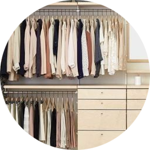
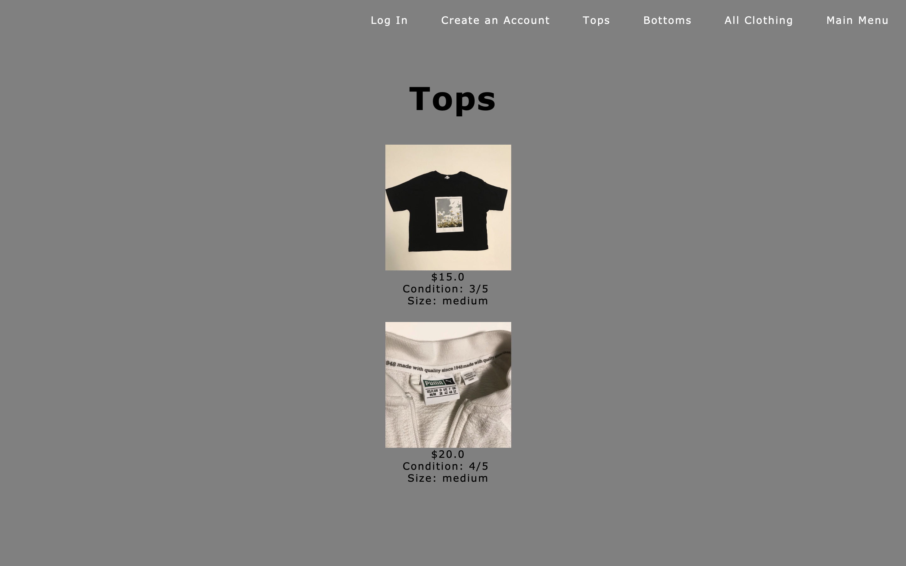
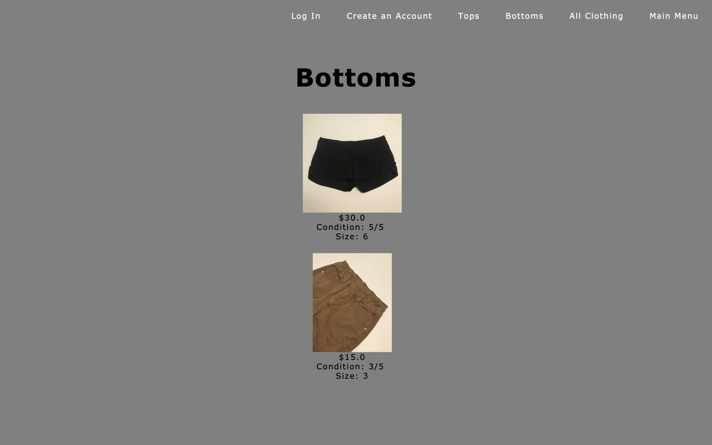

    <h1>
         
        Closet Cleanout
    </h1>

A web application for clothing. Utilizes JSP, JSF/Servlets and a Java DB database in SQL.

## Design

    

        
        
 UML Diagram 

    

    

        
        
 Flow Chart 

    

## Pages

    

        
        
 Main Menu 

    

    

        
        
 Log In 

    

    

        
        
 Create an Account 

    

    

        
        
 Tops 

    

    

        
        
 Bottoms 

    

## User Functionality

    

    
        
 Item View 

    

    

    
        
 User Create Account 

    

    

    
        
 User Log In / Settings 

    

    

    
        
 User Saved Items 

    

## Admin Functionality

    

    
        
 Admin Add Item 

    

    

    
        
 Admin Manage Items 

    

### Users
| Variable        | Type |
| :---------------- | :------ |
| id             |   Integer (non-null, primary key, auto-inc)   |
| FirstName           |   Varchar(255)   |
| LastName           |   Varchar(255)   |
| Email           |   Varchar(255)   |
| Username           |   Varchar(255)   |
| Password           |   Varchar(255)   |

### Items
| Variable        | Type |
| :---------------- | :------ |
| id             |   Integer (non-null, primary key, auto-inc)   |
| Name | Varchar(255) |
| Type | Varchar(255) |
| Price | Double |
| Condition | Integer |
| Size | Varchar(255) |
| Brand | Varchar(255) |
| Link | Varchar(255) |
| Notes | Varchar(255) |
| Sold | Boolean |
| Image1 | Blob |
| Image2 | Blob |
| Image3 | Blob |
| Image4 | Blob |
| Image5 | Blob |

### SavedItems
| Variable        | Type |
| :---------------- | :------ |
| Username | Varchar(255) |
| ItemID | Integer |